## Простой vs Сложный модуль

Когда мы начинали использовать VIPER в своей работе, использовалась концепция "Один экран - один модуль". Это прекрасно работало, потому что экраны в основном представляли собой простые таблицы. Но с появлением первого "сложного" экрана начались сложности.

## Примеры сложных модулей из почты - экран настроек и просмотр письма
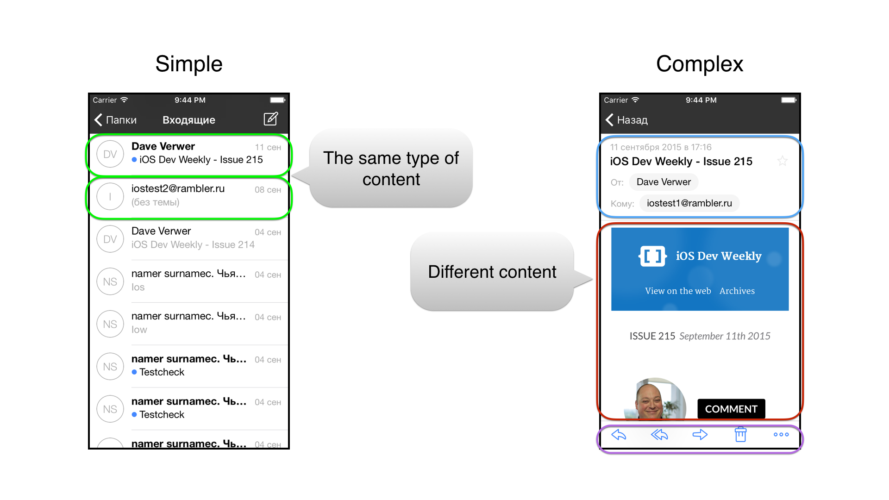
Сложные экраны бывают разные. Например, экран настроек управляет множеством несвязанных между собой элементов.
Экран просмотра сообщения внутри себя содержит шапку, коллекции для контактов, вложений, а также просмотр письма, для которого необходимо применить специальные преобразования.

## Проблемы сложных модулей
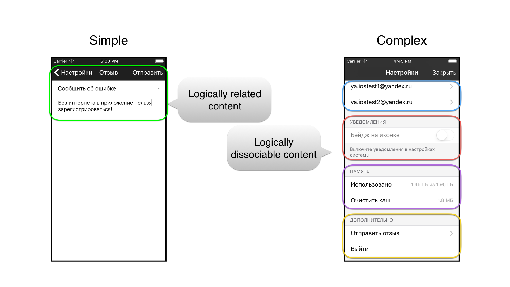
Какие проблемы создают сложные модули?
- Разнородные данные в одном модуле
- Сложная логика работы
- Затруднено тестирование
- Невозможность переиспользования
- Затруднено изменение функций и конфигурации

Например модуль настроек: он должен хранить информацию об имени с подписью, список подключенных ящиков, статус уведомлений...
Каждая секция настроек может влиять на своих соседей по секции, но, теоретически, не должна трогать остальные. Хотя такая возможность у неё есть.
Переиспользовать такой модуль не получится, все заточено под конкретные настройки конкретного приложения.
Добавление или изменение настроек требует изучения(или вспоминания) работу всего модуля.

## Разбиение настроек и просмотра письма на подмодули
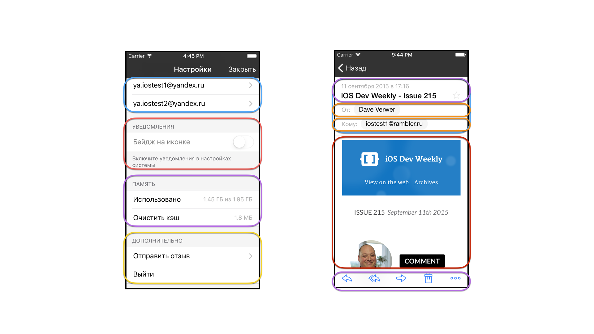
Достаточно очевидно разбиение настроек на подмодули - по секциям. Это логично и наглядно.
Первый модуль - данные пользователя, второй модуль - список подключенных ящиков и так далее.

С модулем просмотра сообщения все тоже достаточно просто - шапка, контакты, вложения(а они ещё и сворачиваются) и просмотр тела письма.

## Подмодули: + и -

### Плюсы подмодулей:
- Единая ответственность - каждый модуль может, а в идеале даже должен, отвечать за какую-то одну функцию
- Тестируемость - маленькие модули легче тестировать
- Переиспользуемость - модуль контактов или вложений может использоваться на экранах написания письма и даже в другом приложении, например мессенджере
- Для добавления новой функции можно добавить новый подмодуль
- Возможность создавать разные конфигурации, например добавить дополнительный пункт настроек только для разработчиков

### Минусы:
- Дополнительный код. Он обеспечивает инициализацию и согласованную работу подмодулей. Его требуется хорошо протестировать. Но есть хорошие новости - он переиспользуемый.
- Опасность избыточного разделения. Система, разбитая на слишком маленькие модули рассыпается, например в настройках не надо делать модуль для каждого пункта.
- Усложнение потоков данных. Если подмодуль подмодуля должен вернуть какие-то данные в основной модуль, цепочка вызовов будет выглядеть гораздо сложнее, чем в случае монолитного модуля.

Поэтому разбиение на подмодули требует хорошего анализа.

## Варианты разделения сложных модулей на подмодули - обзор
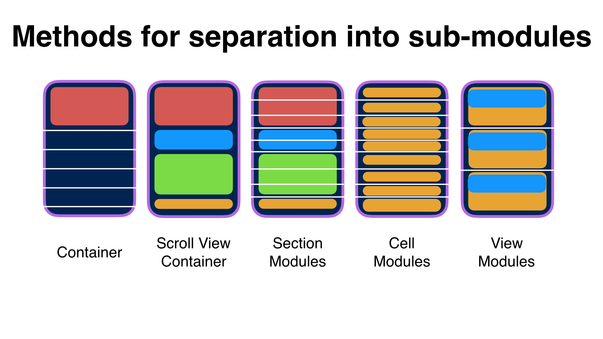
В работе над проектами были использованы 4 варианта композитных модуля:
- Модуль-контейнер
- Его сложный случай Scroll View Controller
- Таблица с группами ячеек - как в настройках
- Таблица с ячейками-модулями

Рассмотрим их подробнее

## Модуль - контейнер
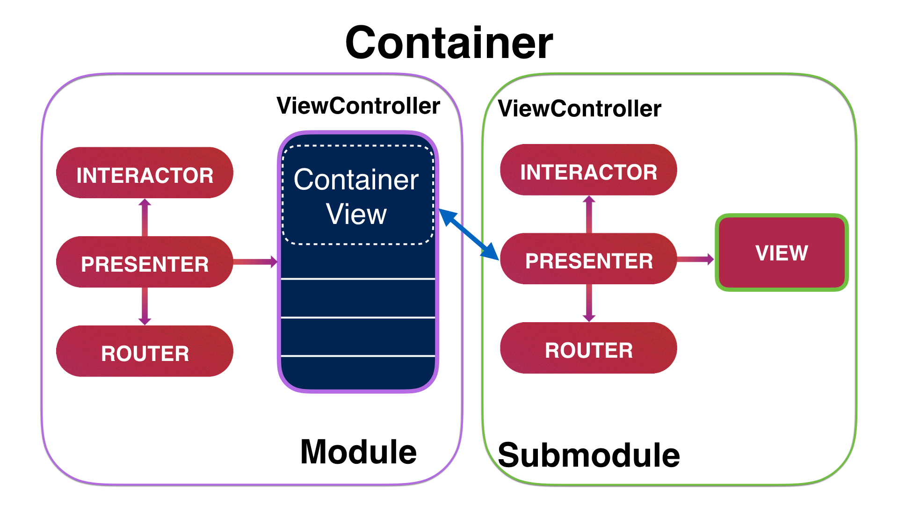
Это аналог Container и EmbedSegue, но управляемый из модуля. Презентер просит роутер добавить дочерний модуль. Роутер инициализирует дочерний модуль, отдает ему данные для работы, добавляет ViewController подмодуля как дочерний для контроллера модуля. И аналогично вьюшка контроллера подмодуля добавляется во вьюшку-контейнер контроллера модуля.
Получаем модуль в модуле. Как это реализовано я расскажу подробнее после обзора вариантов сложных модулей.

Такой подход хорошо использовать, когда требуется отдельная логика работы внутри модуля, например для таблиц, у которых есть сложная шапка.

## Модуль - контейнер - пример

Представьте список постов пользователя, над ними шапка с аватаркой и возможностью написать ему сообщение.
Весь модуль постов занимается только постами, он их загружает, отображает и обрабатывает нажание на ячейку поста с переходом на просмотр поста.
Если сюда добавить ещё загрузку профиля с переходом на написание сообщения, модуль заметно усложнится, поэтому их удобно вынести в отдельный встраиваемый подмодуль. Причем для работы ему требуется только идентификатор пользователя.

## Scroll View Controller
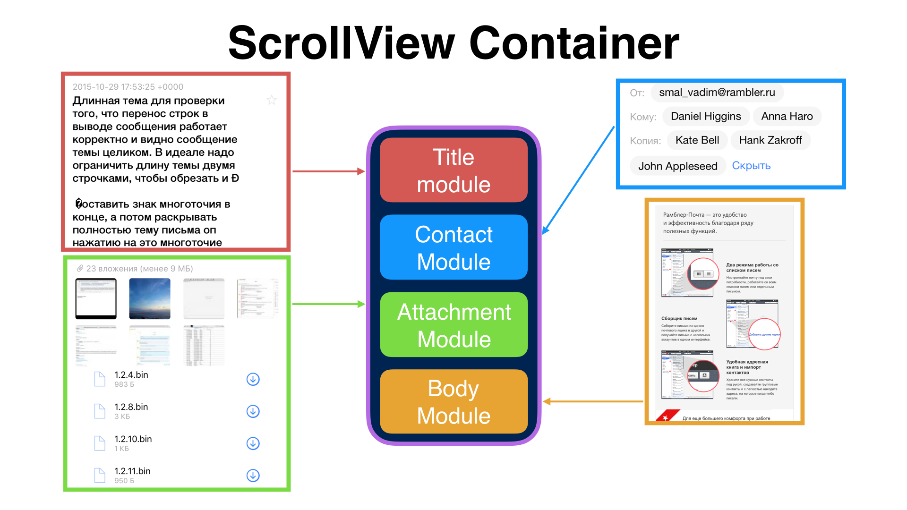
Сложный случай модуля-контейнера. Так реализован экран просмотра сообщений в почте. Внутри Scroll View находится несколько контейнеров, каждый из них независимо управляется своим подмодулем.
Модуль контактов работает только с загрузкой и отображением контактов, отвечает за сокрытие/разворачивание списка.
Модуль вложений разделяет вложения на картинки и документы,  отвечает за сокрытие/разворачивание списка.
Модуль отображения сообщения обрабатывает письма, добавляет переносы в длинные строки, загружает и кеширует inline вложения с картинками.

Причем, как и положено в VIPER, все связанное с загрузкой, обработкой и бизнес-логикой выполяют интеракторы подмодулей. Для этого у них есть ссылки на сервисы. Технически, каждый такой подмодуль можно развернуть на весь экран.

## Таблица с группами ячеек
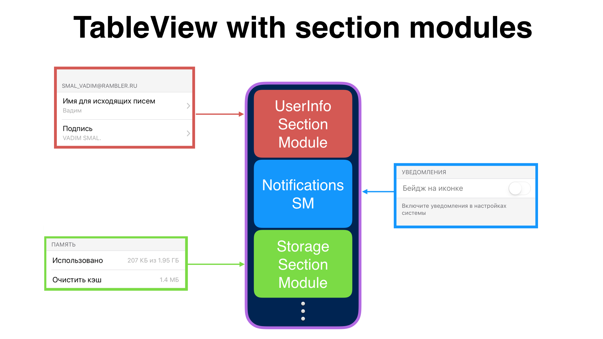
Это способ построения таблицы настроек. Интерактору при инициализации отдается список подмодулей для отображения. Он опрашивает каждый подмодуль и асинхронно получает массив cell-model(view-model для ячеек) для каждого подмодуля. Склеивает их в общий массив и передает своей таблице для отображения. Фабрика ячеек из cell-model получает все необходимые данные для создания и конфигурации ячейки, поэтому универсальна для всех подмодулей.

У подмодулей в качестве View используются фабрики cell-model, они преобразуют данные от presenter в подходящий для отображения в виде ячеек вид, транслируют события из ячеек в presenter, т.е. полностью выполняют всю работу View.

Это позволяет модулю уведомлений работать только с уведомлениями, а модулю подключенных ящиков загрузить список ящиков из своего сервиса для отображения.

## Таблица с ячейками-модулями
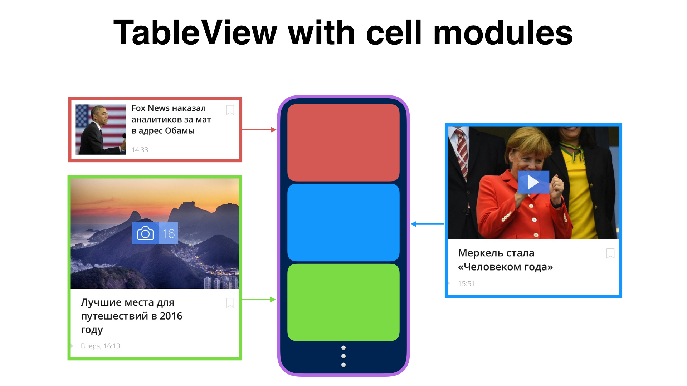
Бывают ситуации, когда отображаемый в таблице контент очень сложный, в ячейке обрабатывается много действий пользователя, ей для работы требуется загружать дополнительные данные или нужно отображать внутри себя CollectionView. В таком случае можно сделать каждую ячейку отдельным модулем.

Сложность в том, что необходимо сделать переиспользуемые не только ячейки, но и модули VIPER. Фабрика ячеек должна настраивать состояние модуля при отображении ячейки. Например в случае с CollectionView внутри ячейки нужно передать ей не только список объектов для отображения, но и задать соответствующий ContentOffset.

Зато это позволяет обрабатывать все действия с события внутри такого подмодуля, в том числе связываться с сервером.

## Модуль View
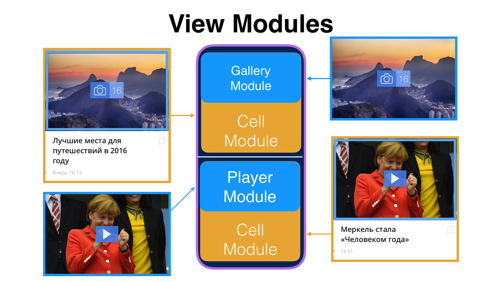
Самый очевидный способ, но наиболее используемый в практике - модуль View. Такой подход хорошо интегрируется с другими подходами. Например, у нас может быть модуль ячейки внутри которой есть подмодуль галереи или видео плеера. Такие подмодули могут быть легко переиспользуемы на других экранах.

## Когда подмодули помогают?
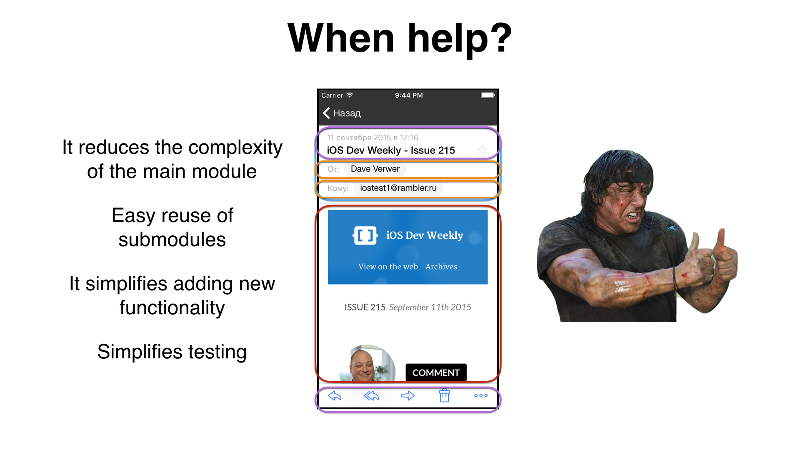
- Уменьшает сложность основного модуля
- Легкое переиспользование подмодулей
- Упрощает добавление новой функциональности
- Упрощает тестирование

## Когда подмодули мешают?
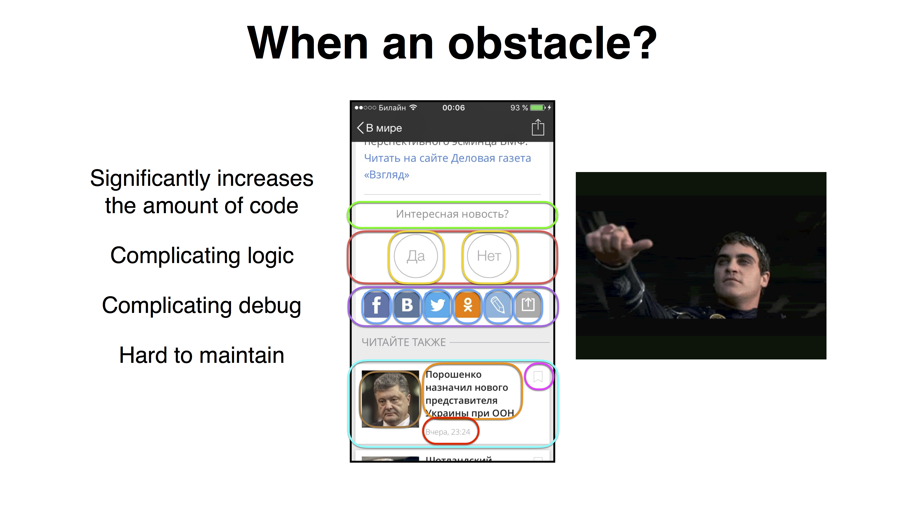
- Значительно увеличивает объем кода
- Усложняет логику
- Усложняет отладку
- Тяжело поддерживать
