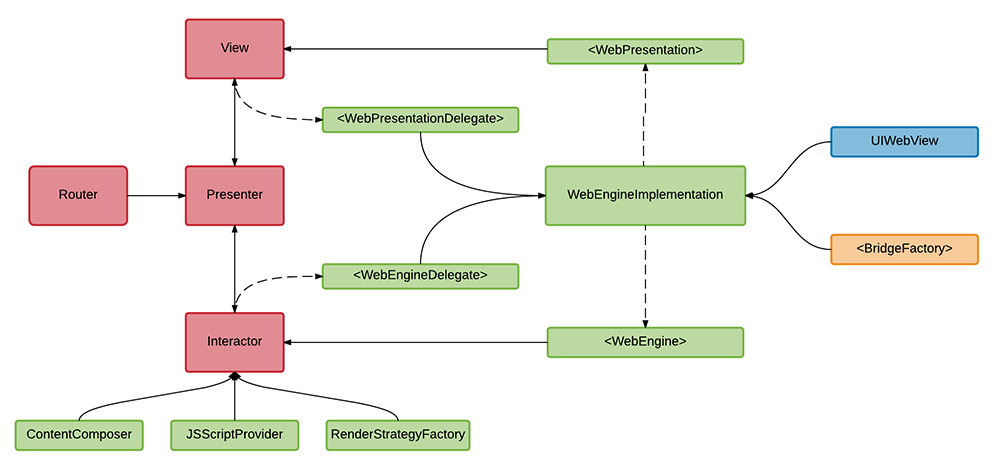

### UIWebView в VIPER

Основная идея - разбить ответственности `UIWebView` на две группы: `WebEngine`, с которым работает Интерактор, и `WebPresentation`, с которым работает View.

#### Ответственности WebEngine
- Загрузка HTML,
- Исполнение JavaScript скриптов,
- Реализация кастомной стратегии рендеринга контента,
- Уведомление Интерактора о событиях окончания отрисовки, загрузки и рендеринга.

#### Ответственности WebPresentation
- Уведомление View о различных пользовательских действиях: нажатии на ссылки, изображения, видео.
- Предоставление интерфейса для получения информации о `UIWebView` как об объекте отображения, к примеру, размера ее контента.



#### Логика работы модуля

1. Assembly устанавливает двух делегатов для `WebEngineImplementation` - View и Interactor.
2. Presenter (или View, в случае ячейки) является входной точкой модуля, в которую приходят сырой html.
3. Presenter получает `WebEngine` у View и передает его в Interactor.
4. Presenter передает в Interactor html данные.
5. Interactor настраивает `WebEngine` путем передачи ему определенных скриптов на выполнение.
6. Interactor передает html в `WebEngine`.
7. `WebEngine` сообщает Interactor'у обо всех этапах загрузки данных.
8. Interactor передает эти callback'и в Presenter, который реализует остальную логику.

Каждый из этих шагов очень прост сам по себе - не больше пяти строк кода. 
Перейдем к рассмотрению реализации каждого из компонентов.

#### `View`

```objc
@interface PostContentCell : UITableViewCell <PostContentViewInput, WebPresentationDelegate>

@property (weak, nonatomic) IBOutlet UIWebView *contentWebView;
@property (strong, nonatomic) id<PostContentViewOutput> output;
@property (strong, nonatomic) id<WebPresentation> webPresentation;

@end

@implementation PostContentCell

- (BOOL)shouldUpdateCellWithObject:(PostContentCellObject *)object {
    [self.output didTriggerModuleSetupEventWithHtmlContent:object.htmlContent];

    return YES;
}

#pragma mark - PostContentViewInput

- (void)setupInitialState {
    [self.webPresentation setupWithWebView:self.contentWebView];
}

#pragma mark - WebPresentationDelegate

- (void)webPresentation:(id<WebPresentation>)webPresentation
             didTapLink:(NSURL *)link {
    [self.output didTriggerLinkTapEventWithURL:link];
}

- (void)webPresentation:(id<WebPresentation>)webPresentation
    didTapImageWithLink:(NSURL *)link {
    [self.output didTriggerImageTapWithURL:link];
}

@end
```

#### `PostContentPresenter`

```objc
@implementation PostContentPresenter

#pragma mark - PostContentViewOutput

- (void)didTriggerModuleSetupEventWithHtmlContent:(NSString *)htmlContent {
    self.rawHtmlContent = htmlContent;

    [self.interactor renderContent:self.rawHtmlContent];
}

- (void)didTriggerLinkTapEventWithURL:(NSURL *)url {
    [self.router showBrowserModuleWithURL:url];
}

- (void)didTriggerImageTapWithURL:(NSURL *)url {
    [self.router showFullscreenImageModuleWithImageURL:url];
}

#pragma mark - PostContentInteractorOutput

- (void)didCompleteRenderingContent {
    CGFloat contentHeight = [self.view obtainCurrentContentHeight];
    [self.moduleOutput didUpdatePostContentWithContentHeight:contentHeight];
}

@end
```

#### `PostContentInteractor`

```objc
@interface PostContentInteractor : NSObject <PostContentInteractorInput, WebEngineDelegate>

@property (nonatomic, weak) id<PostContentInteractorOutput> output;

@property (nonatomic, strong) id<WebEngine> webEngine;
@property (nonatomic, strong) ContentHTMLComposer *contentComposer;
@property (nonatomic, strong) JSScriptProvider *scriptProvider;
@property (nonatomic, strong) ContentRenderStrategyFactory *renderStrategyFactory;

@end

@implementation PostContentInteractor

#pragma mark - PostContentInteractorInput

- (void)renderContent:(NSString *)content {
    NSArray *scripts = [self.scriptProvider obtainScriptsForPostEnvironmentSetup];
    for (NSString *script in scripts) {
        [self.webEngine executeScript:script];
    }

    NSString *processedContent = [self.contentComposer composeValidHtmlForRenderingFromRawHtml:content];

    [self.webEngine loadHtml:processedContent];
}

#pragma mark - WebEngineDelegate

- (void)didCompleteLoadingContentWithWebEngine:(id<WebEngine>)webEngine {
    ContentRenderStrategy *renderStrategy = [self.renderStrategyFactory postContentRenderStrategy];
    [self.webEngine renderContentWithStrategy:renderStrategy];
}

- (void)didCompleteRenderingContentWithWebEngine:(id<WebEngine>)webEngine {
    [self.output didCompleteRenderingContent];
}

@end
```

#### `WebEngineImplementation`

```objc
@interface WebEngineImplementation : NSObject <WebPresentation, WebEngine>

@property (weak, nonatomic) id<WebEngineDelegate> webEngineDelegate;
@property (weak, nonatomic) id<WebPresentationDelegate> webPresentationDelegate;
@property (strong, nonatomic) WebBridgeFactory *bridgeFactory;

@end

@implementation WebEngineImplementation

#pragma mark - WebPresentation

- (void)setupWithWebView:(UIWebView *)webView {
    self.webView = webView;

    self.bridge = [self.bridgeFactory obtainBridgeForWebView:webView
                                             webViewDelegate:self];

    [self setupJavascriptHandlers];
}

#pragma mark - Handlers Setup

- (void)setupJavascriptHandlers {
    @weakify(self);
    [self.bridge registerHandler:kImageTapHandler
                         handler:^(id data, WVJBResponseCallback responseCallback) {
                             @strongify(self);
                             NSString *imageURLString = data[kDataLinkKey];
                             NSURL *imageURL = [NSURL URLWithString:imageURLString];
                             [self.webPresentationDelegate webPresentation:self
                                                       didTapImageWithLink:imageURL];
                         }];
}

#pragma mark - WebEngine

- (void)loadHtml:(NSString *)html {
    [self.webView loadHTMLString:html
                         baseURL:nil];
}

- (void)executeScript:(NSString *)script {
    [self.webView stringByEvaluatingJavaScriptFromString:script];
}

- (void)renderContentWithStrategy:(ContentRenderStrategy *)renderStrategy {
    dispatch_group_t group = dispatch_group_create();
    JSResponseBlock responseBlock = ^(NSDictionary *responseData) {
        NSString *logDescription = responseData[JSLogDescriptionKey];
        DDLogVerbose(@"%@", logDescription);
        dispatch_group_leave(group);
    };

    for (NSString *handlerKey in renderStrategy.scriptNames) {
        dispatch_group_enter(group);
        [self.bridge callHandler:handlerKey
                            data:renderStrategy.scriptPayloads[handlerKey]
                responseCallback:responseBlock];
    }

    [self.webEngineDelegate didCompleteRenderingContentWithWebEngine:self];
}

#pragma mark - UIWebViewDelegate

- (void)webViewDidFinishLoad:(UIWebView *)webView {
    [self.webEngineDelegate didCompleteLoadingContentWithWebEngine:self];
}

- (BOOL)webView:(UIWebView *)webView shouldStartLoadWithRequest:(NSURLRequest *)request navigationType:(UIWebViewNavigationType)navigationType {
    NSString *urlString = request.URL.absoluteString;

    if (navigationType == UIWebViewNavigationTypeLinkClicked) {
        [self.webPresentationDelegate webPresentation:self
                                           didTapLink:request.URL];
        return NO;
    }

    return YES;
}
```

#### Заключение
Помимо явного разделения ответственностей мы скрыли факт использования сторонней зависимости для связи нативного кода и JavaScript - это всего лишь детали реализации протокола `<WebEngine>`. Unit-тесты для всех компонентов получились очень простыми. Все, что нужно проверить - это правильность data flow.
